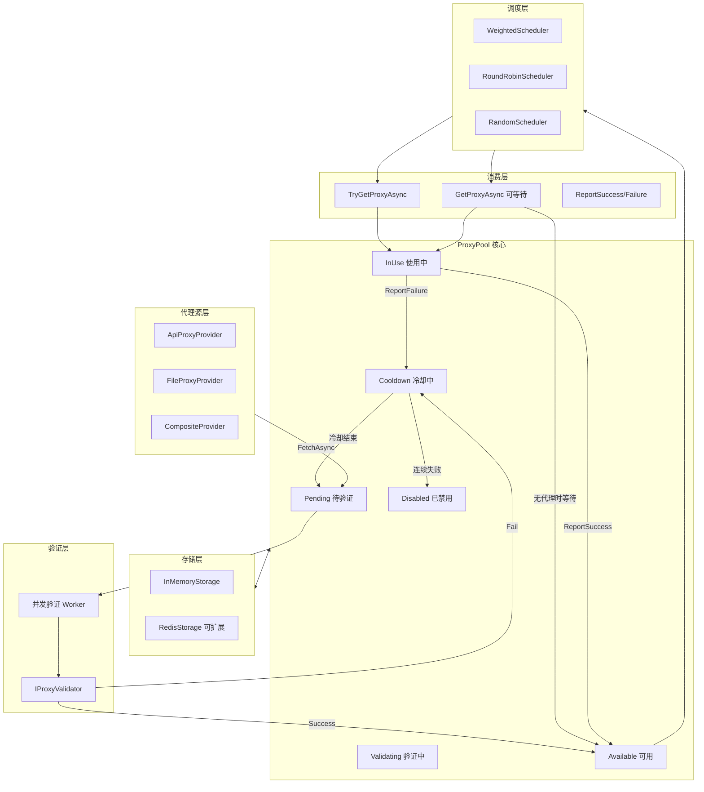
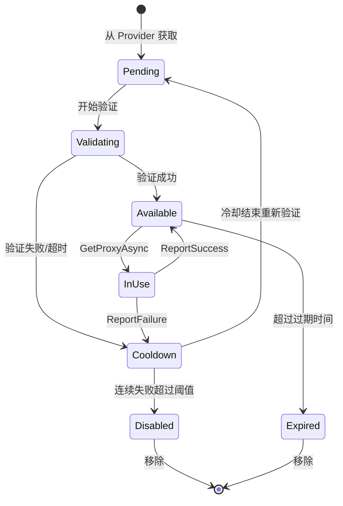

# Smart.ProxyPilot 智能代理池框架

## 项目结构

```
Smart.ProxyPilot/
├── Smart.ProxyPilot.sln
│
├── src/
│   └── Smart.ProxyPilot/
│       ├── Smart.ProxyPilot.csproj
│       │
│       ├── Abstractions/                    # 核心抽象层
│       │   ├── IProxyProvider.cs            # 代理源接口
│       │   ├── IProxyValidator.cs           # 验证器接口
│       │   ├── IProxyScheduler.cs           # 调度器接口
│       │   ├── IProxyPool.cs                # 代理池接口
│       │   └── IProxyStorage.cs             # 存储接口（内存/Redis等）
│       │
│       ├── Models/                          # 数据模型
│       │   ├── ProxyInfo.cs                 # 代理信息
│       │   ├── ProxyState.cs                # 代理状态枚举
│       │   ├── ProxyStatistics.cs           # 详细统计信息
│       │   ├── ValidationResult.cs          # 验证结果
│       │   └── ProxyPoolSnapshot.cs         # 池快照/状态
│       │
│       ├── Events/                          # 事件系统
│       │   ├── ProxyEventArgs.cs            # 事件参数基类
│       │   ├── ProxyValidatedEventArgs.cs   # 验证完成事件
│       │   ├── ProxyStateChangedEventArgs.cs# 状态变更事件
│       │   └── PoolStateChangedEventArgs.cs # 池状态变更事件
│       │
│       ├── Providers/                       # 代理源实现
│       │   ├── ApiProxyProvider.cs          # API 代理源
│       │   ├── FileProxyProvider.cs         # 文件代理源
│       │   └── CompositeProxyProvider.cs    # 组合代理源
│       │
│       ├── Validators/                      # 验证器实现
│       │   ├── HttpProxyValidator.cs        # HTTP 验证器
│       │   └── CompositeProxyValidator.cs   # 组合验证器
│       │
│       ├── Scheduling/                      # 调度器实现
│       │   ├── RoundRobinScheduler.cs       # 轮询调度
│       │   ├── WeightedScheduler.cs         # 加权调度
│       │   └── RandomScheduler.cs           # 随机调度
│       │
│       ├── Storage/                         # 存储实现
│       │   └── InMemoryProxyStorage.cs      # 内存存储
│       │
│       ├── ProxyPool.cs                     # 代理池核心实现
│       ├── ProxyPoolOptions.cs              # 配置选项
│       └── ProxyPoolBuilder.cs              # 构建器模式
│
├── samples/
│   └── Smart.ProxyPilot.Demo/               # 控制台示例
│       ├── Smart.ProxyPilot.Demo.csproj
│       └── Program.cs
│
└── tests/
    └── Smart.ProxyPilot.Tests/              # 单元测试
        ├── Smart.ProxyPilot.Tests.csproj
        │
        ├── Models/
        │   ├── ProxyInfoTests.cs
        │   └── ProxyStatisticsTests.cs
        │
        ├── Validators/
        │   └── HttpProxyValidatorTests.cs
        │
        ├── Schedulers/
        │   ├── WeightedSchedulerTests.cs
        │   ├── RoundRobinSchedulerTests.cs
        │   └── RandomSchedulerTests.cs
        │
        ├── Storage/
        │   └── InMemoryProxyStorageTests.cs
        │
        ├── ProxyPoolTests.cs                # 代理池集成测试
        │
        └── Fixtures/                        # 测试夹具
            ├── MockProxyProvider.cs
            └── MockProxyValidator.cs
```

## 核心架构




## 状态流转图




## 核心类设计

### 1. 状态枚举

```csharp
// 代理状态
public enum ProxyState
{
    Pending,        // 待验证
    Validating,     // 验证中
    Available,      // 可用
    InUse,          // 使用中
    Cooldown,       // 冷却中（失败后短暂休息）
    Disabled,       // 已禁用（多次失败）
    Expired         // 已过期
}

// 代理类型
public enum ProxyType
{
    Http,
    Https,
    Socks4,
    Socks5
}

// 验证结果类型
public enum ValidationResultType
{
    Success,        // 成功
    Timeout,        // 超时
    ConnectionFailed,   // 连接失败
    AuthenticationFailed, // 认证失败
    InvalidResponse,    // 响应无效
    Exception       // 其他异常
}
```

### 2. ProxyStatistics 详细统计

```csharp
public class ProxyStatistics
{
    // 验证统计
    public int TotalValidationCount { get; set; }
    public int ValidationSuccessCount { get; set; }
    public int ValidationFailCount { get; set; }
    public int ValidationTimeoutCount { get; set; }

    // 使用统计
    public int TotalUseCount { get; set; }
    public int UseSuccessCount { get; set; }
    public int UseFailCount { get; set; }
    public int UseTimeoutCount { get; set; }

    // 响应时间统计
    public double MinResponseTime { get; set; }
    public double MaxResponseTime { get; set; }
    public double AvgResponseTime { get; set; }
    public double LastResponseTime { get; set; }

    // 时间戳
    public DateTime CreatedAt { get; set; }
    public DateTime? FirstValidatedAt { get; set; }
    public DateTime? LastValidatedAt { get; set; }
    public DateTime? LastUsedAt { get; set; }
    public DateTime? LastSuccessAt { get; set; }
    public DateTime? LastFailAt { get; set; }

    // 连续统计
    public int ConsecutiveFailCount { get; set; }
    public int ConsecutiveSuccessCount { get; set; }

    // 计算属性
    public double ValidationSuccessRate => TotalValidationCount > 0
        ? (double)ValidationSuccessCount / TotalValidationCount : 0;
    public double UseSuccessRate => TotalUseCount > 0
        ? (double)UseSuccessCount / TotalUseCount : 0;
}
```

### 3. ProxyInfo 模型

```csharp
public class ProxyInfo
{
    // 唯一标识
    public string Id { get; }  // 自动生成: {Host}:{Port}

    // 基本信息
    public string Host { get; set; }
    public int Port { get; set; }
    public ProxyType Type { get; set; }
    public string? Username { get; set; }
    public string? Password { get; set; }

    // 元数据（来源信息等）
    public string? Source { get; set; }        // 来源标识
    public string? Country { get; set; }       // 国家
    public string? Region { get; set; }        // 地区
    public bool IsAnonymous { get; set; }      // 是否匿名
    public Dictionary<string, object>? Metadata { get; set; }

    // 状态
    public ProxyState State { get; set; }

    // 统计信息
    public ProxyStatistics Statistics { get; }

    // 计算权重（基于统计）
    public double CalculateWeight() { ... }

    // 辅助方法
    public WebProxy ToWebProxy();
    public Uri ToUri();
    public override string ToString() => $"{Type}://{Host}:{Port}";
}
```

### 4. ValidationResult 验证结果

```csharp
public class ValidationResult
{
    public bool IsSuccess { get; set; }
    public ValidationResultType ResultType { get; set; }
    public TimeSpan ResponseTime { get; set; }
    public int? StatusCode { get; set; }
    public string? ErrorMessage { get; set; }
    public Exception? Exception { get; set; }
    public DateTime ValidatedAt { get; set; }

    // 工厂方法
    public static ValidationResult Success(TimeSpan responseTime, int statusCode);
    public static ValidationResult Timeout(TimeSpan elapsed);
    public static ValidationResult Failed(ValidationResultType type, string message, Exception? ex = null);
}
```

### 5. ProxyPoolSnapshot 池状态快照

```csharp
public class ProxyPoolSnapshot
{
    public DateTime Timestamp { get; set; }

    // 代理数量统计
    public int TotalCount { get; set; }
    public int PendingCount { get; set; }
    public int ValidatingCount { get; set; }
    public int AvailableCount { get; set; }
    public int InUseCount { get; set; }
    public int CooldownCount { get; set; }
    public int DisabledCount { get; set; }

    // 验证统计
    public long TotalValidations { get; set; }
    public long SuccessfulValidations { get; set; }
    public long FailedValidations { get; set; }

    // 获取统计
    public long TotalGetRequests { get; set; }
    public long SuccessfulGetRequests { get; set; }
    public long WaitingGetRequests { get; set; }

    // 性能指标
    public double AvgValidationTime { get; set; }
    public double AvgResponseTime { get; set; }
    public double OverallSuccessRate { get; set; }
}
```

### 6. ProxyPoolOptions 配置

```csharp
public class ProxyPoolOptions
{
    // 验证配置
    public TimeSpan ValidationTimeout { get; set; } = TimeSpan.FromSeconds(10);
    public int ValidationConcurrency { get; set; } = 10;
    public string ValidationUrl { get; set; } = "http://httpbin.org/ip";
    public Func<HttpResponseMessage, ValueTask<bool>>? ValidationFunc { get; set; }
    public TimeSpan ValidationInterval { get; set; } = TimeSpan.FromMinutes(5); // 重新验证间隔

    // 池配置
    public int MinPoolSize { get; set; } = 5;
    public int MaxPoolSize { get; set; } = 100;
    public TimeSpan ProxyExpireTime { get; set; } = TimeSpan.FromHours(1); // 代理过期时间

    // 调度配置
    public int MaxConsecutiveFailCount { get; set; } = 3;  // 连续失败次数后禁用
    public TimeSpan CooldownDuration { get; set; } = TimeSpan.FromMinutes(1); // 冷却时间

    // 获取配置
    public TimeSpan DefaultGetTimeout { get; set; } = TimeSpan.FromSeconds(30);
    public bool RemoveAfterGet { get; set; } = false; // 获取后是否移除（一次性使用）

    // 补充配置
    public int FetchBatchSize { get; set; } = 50;  // 每次从 Provider 获取的数量
    public TimeSpan FetchInterval { get; set; } = TimeSpan.FromMinutes(1); // 补充间隔
}
```

### 7. 核心抽象接口

```csharp
// 代理源接口
public interface IProxyProvider
{
    string Name { get; }
    ValueTask<IEnumerable<ProxyInfo>> FetchAsync(int count, CancellationToken ct = default);
}

// 验证器接口
public interface IProxyValidator
{
    ValueTask<ValidationResult> ValidateAsync(ProxyInfo proxy, CancellationToken ct = default);
}

// 调度器接口
public interface IProxyScheduler
{
    ProxyInfo? Select(IReadOnlyList<ProxyInfo> proxies);
    void OnProxyUsed(ProxyInfo proxy, bool success, TimeSpan? responseTime);
}

// 存储接口（便于扩展 Redis 等）
public interface IProxyStorage
{
    ValueTask AddAsync(ProxyInfo proxy, CancellationToken ct = default);
    ValueTask<ProxyInfo?> GetByIdAsync(string id, CancellationToken ct = default);
    ValueTask UpdateAsync(ProxyInfo proxy, CancellationToken ct = default);
    ValueTask RemoveAsync(string id, CancellationToken ct = default);
    ValueTask<IReadOnlyList<ProxyInfo>> GetByStateAsync(ProxyState state, CancellationToken ct = default);
    ValueTask<ProxyPoolSnapshot> GetSnapshotAsync(CancellationToken ct = default);
}

// 代理池接口
public interface IProxyPool : IAsyncDisposable
{
    // 生命周期
    Task StartAsync(CancellationToken ct = default);
    Task StopAsync(CancellationToken ct = default);

    // 获取代理
    ValueTask<ProxyInfo?> TryGetProxyAsync(CancellationToken ct = default);
    ValueTask<ProxyInfo> GetProxyAsync(TimeSpan? timeout = null, CancellationToken ct = default);

    // 反馈
    void ReportSuccess(ProxyInfo proxy, TimeSpan? responseTime = null);
    void ReportFailure(ProxyInfo proxy, string? reason = null);

    // 状态
    ProxyPoolSnapshot GetSnapshot();

    // 事件
    event EventHandler<ProxyValidatedEventArgs>? ProxyValidated;
    event EventHandler<ProxyStateChangedEventArgs>? ProxyStateChanged;
    event EventHandler<PoolStateChangedEventArgs>? PoolStateChanged;
}
```

### 8. ProxyPoolBuilder 构建器

```csharp
public class ProxyPoolBuilder
{
    public ProxyPoolBuilder Configure(Action<ProxyPoolOptions> configure);
    public ProxyPoolBuilder AddProvider(IProxyProvider provider);
    public ProxyPoolBuilder AddProvider<T>() where T : IProxyProvider;
    public ProxyPoolBuilder UseValidator(IProxyValidator validator);
    public ProxyPoolBuilder UseValidator<T>() where T : IProxyValidator;
    public ProxyPoolBuilder UseScheduler(IProxyScheduler scheduler);
    public ProxyPoolBuilder UseScheduler<T>() where T : IProxyScheduler;
    public ProxyPoolBuilder UseStorage(IProxyStorage storage);
    public ProxyPoolBuilder UseStorage<T>() where T : IProxyStorage;
    public IProxyPool Build();
}

// 使用示例
var pool = new ProxyPoolBuilder()
    .Configure(opt => {
        opt.ValidationTimeout = TimeSpan.FromSeconds(5);
        opt.ValidationConcurrency = 20;
        opt.MaxConsecutiveFailCount = 5;
    })
    .AddProvider(new ApiProxyProvider("https://api.proxy.com/get"))
    .UseValidator(new HttpProxyValidator("https://www.baidu.com"))
    .UseScheduler<WeightedScheduler>()
    .Build();
```

## 实现要点

### 多线程验证

- 使用 `Channel<ProxyInfo>` 作为待验证队列
- 使用 `SemaphoreSlim` 控制并发数
- 后台 Task 持续消费 Channel 进行验证
- 验证结果更新到 `IProxyStorage`

### 等待获取机制

- 使用 `TaskCompletionSource` 队列实现等待通知
- 当新代理加入可用队列时，按顺序唤醒等待者
- 支持超时和 CancellationToken

### 加权调度算法

- 权重计算公式: `Weight = SuccessRate * (1 / AvgResponseTime) * FreshnessBonus`
- FreshnessBonus: 最近使用过的代理权重略降，避免过度使用
- 使用加权随机选择算法

### 状态管理

- 所有状态变更通过事件通知
- 使用 `IProxyStorage` 抽象存储，便于扩展 Redis 分布式存储

## Demo 示例

```csharp
// 使用 Builder 构建代理池
var pool = new ProxyPoolBuilder()
    .Configure(opt =>
    {
        opt.ValidationTimeout = TimeSpan.FromSeconds(5);
        opt.ValidationConcurrency = 20;
        opt.ValidationUrl = "https://www.baidu.com";
        opt.MinPoolSize = 10;
        opt.MaxConsecutiveFailCount = 3;
        opt.CooldownDuration = TimeSpan.FromMinutes(2);
    })
    .AddProvider(new ApiProxyProvider("https://api.proxy.com/get", new ApiProxyProviderOptions
    {
        BatchSize = 100,
        ParseFunc = json => ParseProxiesFromJson(json) // 自定义解析
    }))
    .UseValidator(new HttpProxyValidator(new HttpProxyValidatorOptions
    {
        ValidationUrl = "https://www.baidu.com",
        ExpectedStatusCode = 200,
        // 自定义验证逻辑
        ValidationFunc = async response =>
        {
            var content = await response.Content.ReadAsStringAsync();
            return content.Contains("百度");
        }
    }))
    .UseScheduler<WeightedScheduler>()
    .Build();

// 订阅事件
pool.ProxyValidated += (sender, e) =>
{
    Console.WriteLine($"[验证] {e.Proxy} - {e.Result.ResultType} ({e.Result.ResponseTime.TotalMilliseconds}ms)");
};

pool.ProxyStateChanged += (sender, e) =>
{
    Console.WriteLine($"[状态] {e.Proxy} - {e.OldState} -> {e.NewState}");
};

// 启动
await pool.StartAsync();

// 获取快照
var snapshot = pool.GetSnapshot();
Console.WriteLine($"可用: {snapshot.AvailableCount}, 验证中: {snapshot.ValidatingCount}");

// 方式1: 尝试获取（不等待）
var proxy1 = await pool.TryGetProxyAsync();
if (proxy1 != null)
{
    // 使用代理...
}

// 方式2: 等待获取（支持超时和取消）
using var cts = new CancellationTokenSource(TimeSpan.FromSeconds(30));
try
{
    var proxy2 = await pool.GetProxyAsync(timeout: TimeSpan.FromSeconds(10), ct: cts.Token);

    // 使用代理
    var sw = Stopwatch.StartNew();
    using var handler = new HttpClientHandler { Proxy = proxy2.ToWebProxy() };
    using var client = new HttpClient(handler);

    try
    {
        var response = await client.GetAsync("https://target.com", cts.Token);
        sw.Stop();

        // 反馈成功
        pool.ReportSuccess(proxy2, responseTime: sw.Elapsed);
    }
    catch (Exception ex)
    {
        // 反馈失败
        pool.ReportFailure(proxy2, reason: ex.Message);
    }
}
catch (OperationCanceledException)
{
    Console.WriteLine("获取代理超时或被取消");
}

// 停止
await pool.StopAsync();
await pool.DisposeAsync();
```

### 自定义 API Provider 示例

```csharp
public class MyApiProxyProvider : IProxyProvider
{
    public string Name => "MyApi";

    private readonly HttpClient _client;
    private readonly string _apiUrl;

    public MyApiProxyProvider(string apiUrl)
    {
        _apiUrl = apiUrl;
        _client = new HttpClient();
    }

    public async ValueTask<IEnumerable<ProxyInfo>> FetchAsync(int count, CancellationToken ct = default)
    {
        var response = await _client.GetStringAsync($"{_apiUrl}?num={count}", ct);
        var json = JsonDocument.Parse(response);

        return json.RootElement.GetProperty("data").EnumerateArray()
            .Select(item => new ProxyInfo
            {
                Host = item.GetProperty("ip").GetString()!,
                Port = item.GetProperty("port").GetInt32(),
                Type = ProxyType.Http,
                Source = Name,
                Country = item.TryGetProperty("country", out var c) ? c.GetString() : null
            });
    }
}
```

## 单元测试设计

使用 xUnit + Moq 进行单元测试。

### 测试覆盖范围


| 模块         | 测试类                       | 测试内容             |
| ---------- | ------------------------- | ---------------- |
| Models     | ProxyInfoTests            | 创建、权重计算、状态转换     |
| Models     | ProxyStatisticsTests      | 统计更新、成功率计算       |
| Validators | HttpProxyValidatorTests   | 成功验证、超时、失败、自定义验证 |
| Schedulers | WeightedSchedulerTests    | 加权选择、权重更新        |
| Schedulers | RoundRobinSchedulerTests  | 轮询顺序             |
| Storage    | InMemoryProxyStorageTests | CRUD、状态查询、快照     |
| Pool       | ProxyPoolTests            | 启动停止、获取等待、事件触发   |


### 测试示例

```csharp
public class WeightedSchedulerTests
{
    [Fact]
    public void Select_ShouldPreferHigherWeightProxy()
    {
        // Arrange
        var scheduler = new WeightedScheduler();
        var proxies = new List<ProxyInfo>
        {
            CreateProxy("1.1.1.1", successRate: 0.9, avgResponseTime: 100),
            CreateProxy("2.2.2.2", successRate: 0.5, avgResponseTime: 500),
        };

        // Act - 多次选择统计
        var selections = Enumerable.Range(0, 1000)
            .Select(_ => scheduler.Select(proxies))
            .GroupBy(p => p.Host)
            .ToDictionary(g => g.Key, g => g.Count());

        // Assert - 高权重代理被选中次数应该更多
        Assert.True(selections["1.1.1.1"] > selections["2.2.2.2"]);
    }
}

public class ProxyPoolTests
{
    [Fact]
    public async Task GetProxyAsync_ShouldWaitWhenPoolEmpty()
    {
        // Arrange
        var pool = CreatePool();
        await pool.StartAsync();

        // Act
        var getTask = pool.GetProxyAsync(timeout: TimeSpan.FromSeconds(5));

        // 模拟延迟添加代理
        await Task.Delay(100);
        await AddMockProxy(pool);

        var proxy = await getTask;

        // Assert
        Assert.NotNull(proxy);
    }

    [Fact]
    public async Task GetProxyAsync_ShouldThrowOnTimeout()
    {
        // Arrange
        var pool = CreatePool();
        await pool.StartAsync();

        // Act & Assert
        await Assert.ThrowsAsync<TimeoutException>(
            () => pool.GetProxyAsync(timeout: TimeSpan.FromMilliseconds(100)).AsTask()
        );
    }
}
```

### Mock 夹具

```csharp
public class MockProxyProvider : IProxyProvider
{
    private readonly List<ProxyInfo> _proxies;

    public string Name => "Mock";

    public MockProxyProvider(IEnumerable<ProxyInfo>? proxies = null)
    {
        _proxies = proxies?.ToList() ?? new List<ProxyInfo>();
    }

    public void AddProxy(ProxyInfo proxy) => _proxies.Add(proxy);

    public ValueTask<IEnumerable<ProxyInfo>> FetchAsync(int count, CancellationToken ct = default)
    {
        return ValueTask.FromResult<IEnumerable<ProxyInfo>>(_proxies.Take(count).ToList());
    }
}

public class MockProxyValidator : IProxyValidator
{
    public Func<ProxyInfo, ValidationResult>? ValidateFunc { get; set; }

    public ValueTask<ValidationResult> ValidateAsync(ProxyInfo proxy, CancellationToken ct = default)
    {
        var result = ValidateFunc?.Invoke(proxy)
            ?? ValidationResult.Success(TimeSpan.FromMilliseconds(100), 200);
        return ValueTask.FromResult(result);
    }
}
```
